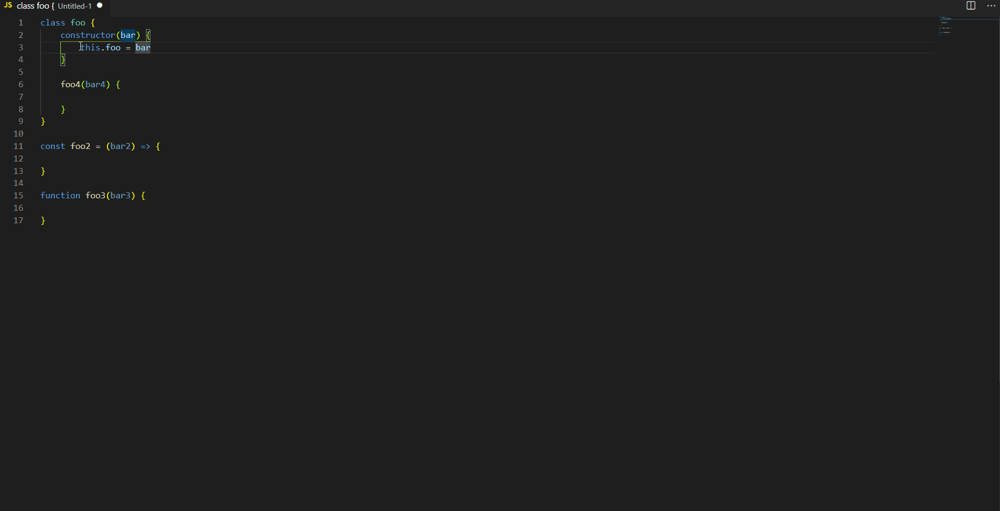

# Super Console Log

A little extension that adds a command for console.log with filename an classes/functions enclosures

## Features

Add the command `superconsolelog.log` and the keybind `CTRL+K J` for make a console.log out of a selection

-----------------------------------------------------------------------------------------------------------

## Extension Settings

There are the next settings fot the extension

This extension have the following settings:

* `superConsoleLog.endSemiColon`: if `true` the console.log will end with `;`. The default is true

* `superConsoleLog.quotes`: a list of quotes to choose for use in the console.log. Default is `"`
* `superConsoleLog.includeFileName`: set to `true` will include the filename of the console.log. Default is `true`
* `superConsoleLog.includeFullPath`: set to `true` the extension will add the full path of the file in the console.log. Default is `false`
* `superConsoleLog.includeEnclosureFunctionName`: how many function enclosure the extension will put in the console.log. Default is `2`
* `superConsoleLog.includeEnclosureClassName`: how many class enclosure the extension will put in the console.log. Default is `1`
* `superConsoleLog.includeLineNum`: set to `true` the extension will add the line number in the beginning of the console.log. Default is `true`

-----------------------------------------------------------------------------------------------------------

## Release Notes

[See changelog](CHANGELOG.md)

-----------------------------------------------------------------------------------------------------------

## Author

### Giova978
